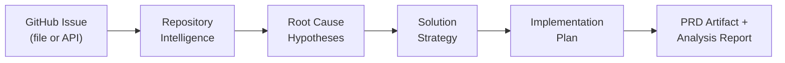
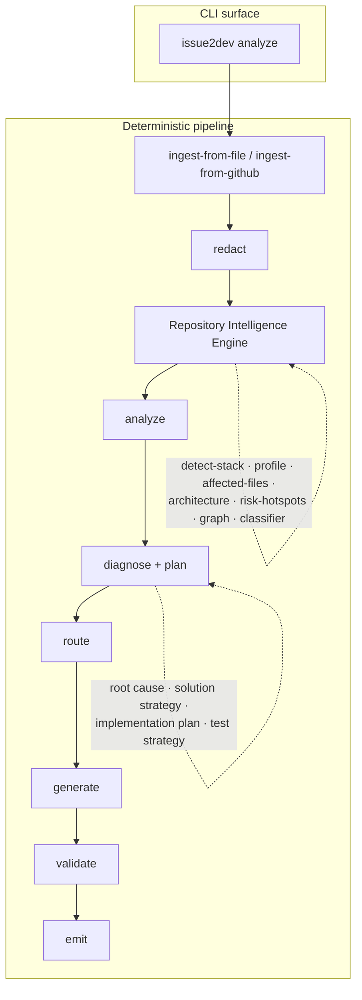

<div align="center">


### Repository-aware implementation planning for GitHub issues.

Turn a messy GitHub issue into **repository-grounded context** and a **deterministic engineering diagnosis** — root cause hypotheses, a solution strategy, an implementation plan, and a PRD — entirely offline, with every claim traceable to evidence. No code fixes, no writeback.

[](LICENSE)
[](https://nodejs.org)
[](https://www.typescriptlang.org)
[](.github/workflows/ci.yml)
[](#project-status)

[Quick Start](#quick-start) · [How it works](#how-issue2dev-works) · [Repository Intelligence](#repository-intelligence) · [CLI Reference](#cli-reference) · [Roadmap](#roadmap--planned-features)

</div>

---

Issue2Dev reads a GitHub issue, builds a bounded **`RepositoryContext`** about the repository it belongs to, and only *then* generates planning artifacts. Generation always consumes repository context — never raw issue text alone.

> [!NOTE]
> **v0.1 is deliberately small and offline-first.** One command (`analyze`), no AI provider calls, no writeback to GitHub, and deterministic outputs you can diff in code review. Everything below describes what is **implemented today**. Anything not yet built lives in the [Roadmap](#roadmap--planned-features) and is clearly marked as planned.

---

## The problem

A GitHub issue usually contains the *seed* of a good implementation plan, but rarely the context an engineer needs to act with confidence:

- Which files or areas of the codebase will this touch?
- What kind of repository is this — an app, a library, a service?
- How risky and how large does the change look?
- Which statements came from the **issue text**, and which came from **repository signals**?
- What should be written down *before* anyone changes code?

Raw issue text doesn't answer these. And pasting an issue into a generic LLM produces fluent prose that **looks** authoritative but hides where each claim came from — and gives you a different answer every time you ask.

## Why Issue2Dev exists

Issue2Dev is built on one thesis:

> **Better implementation planning starts with repository intelligence, before generation.**

Instead of hiding uncertainty behind confident automation, Issue2Dev makes the analysis trail **visible and reproducible**:

- It builds a repository-aware context object first.
- It labels every heuristic with a confidence score and the evidence behind it.
- It produces the same output for the same input, every time.
- It never treats untrusted issue text as instructions.

The result is an artifact you can review like code, not a paragraph you have to take on faith.

## Why Repository Intelligence matters

This is the core differentiator. Most "issue → plan" tools flatten the issue into a prompt and let a model improvise. Issue2Dev does the opposite: it spends its effort **understanding the repository** and then grounds generation in that understanding.

|                              | Raw issue text | Generic LLM summary | **Issue2Dev** |
| ---------------------------- | :------------: | :-----------------: | :-----------: |
| Repository-aware             |              |      shallow      |    `RepositoryContext` |
| Deterministic / reproducible |              |                   |              |
| Evidence & provenance        |              |                   |    per claim |
| Confidence-labeled heuristics|              |                   |              |
| Works fully offline          |              |                   |    (`--from-file`) |
| Treats issue text as untrusted|      n/a      |     usually no    |              |
| No vendor / API key required |              |                   |              |

> [!IMPORTANT]
> Issue2Dev's heuristics are intentionally modest and clearly labeled. Affected-file predictions, architecture inference, and risk hotspots are **confidence-scored guesses grounded in evidence**, not certainties. The point is an honest, inspectable starting context — not magic.

## How Issue2Dev works



1. **Ingest** an issue from a local JSON file (`--from-file`) or read-only from GitHub (`--repo` + `--issue`).
2. **Build** a bounded `RepositoryContext` with the deterministic Repository Intelligence Engine (RIE).
3. **Analyze** the context into scores and a classification (severity, impact, risk, priority, estimate).
4. **Diagnose** — produce deterministic **root cause hypotheses**, a **solution strategy**, an **implementation plan**, and a **test strategy**, each with confidence + evidence and explicit limitations.
5. **Generate** a PRD-style artifact grounded in that context and diagnosis, with provenance and caveats.
6. **Emit** everything as local JSON + Markdown under a `.issue2dev/` directory.

No code fixes. No writeback. No background service. No hidden provider call.

## Architecture overview



The public CLI is intentionally thin. Both local fixtures and read-only GitHub ingestion flow through the **same deterministic pipeline**, so a local fixture run and a real issue run differ only in their ingestion source.

## Features

| Implemented in v0.1 | |
| --- | --- |
|  **Repository Intelligence Engine** | Builds a bounded `RepositoryContext` from issue + repository signals. |
|  **Engineering diagnosis** | Deterministic root-cause hypotheses, solution strategy, implementation plan, and test strategy — each with confidence, evidence, and limitations. No code fixes. |
|  **Deterministic output** | Same inputs → identical outputs. Diff-friendly, reviewable. |
|  **Evidence & provenance** | Every heuristic carries a confidence score and source evidence; artifacts include a content hash. |
|  **Read-only GitHub ingestion** | Reads an issue and repository signals; writes only local files. |
|  **PRD artifact generation** | Repository-grounded PRD Markdown with explicit caveats. |
|  **Single, honest CLI** | One `analyze` command, no hidden surface area. |
|  **Offline-friendly** | `--from-file` runs with no network access. |
|  **Untrusted-input handling** | Issue text is treated as data, never as instructions. |

## Installation

> [!NOTE]
> Issue2Dev v0.1 is run from source. Requirements: **Node.js ≥ 20** and **pnpm 10** (the repo pins `pnpm@10` via `packageManager`; [Corepack](https://nodejs.org/api/corepack.html) will resolve the correct version automatically — no exact patch version to install).

```bash
git clone <repository-url>
cd issue2dev
pnpm install
pnpm run build
```

After building, the local binary is available through pnpm:

```bash
pnpm exec issue2dev analyze --from-file examples/from-file/issue-42.json --out .issue2dev/quickstart
```

## Quick Start

```bash
# 1. Install & build
pnpm install
pnpm run build

# 2. Analyze the bundled example issue (offline, no network)
pnpm exec issue2dev analyze \
  --from-file examples/from-file/issue-42.json \
  --out .issue2dev/42-cli

# 3. Open the generated files
#   .issue2dev/42-cli/repository-context.json
#   .issue2dev/42-cli/analysis.json
#   .issue2dev/42-cli/analysis.md
#   .issue2dev/42-cli/artifacts.json
#   .issue2dev/42-cli/prd.md
```

> [!TIP]
> The `--out` directory must live under a `.issue2dev/` path — Issue2Dev enforces this so generated output stays isolated and git-ignored.

## Analyze a local issue

Use `--from-file` for fully offline, repeatable runs. The input is a normalized issue JSON file (see [`examples/from-file/issue-42.json`](examples/from-file/issue-42.json)):

```bash
pnpm exec issue2dev analyze --from-file examples/from-file/issue-42.json --out .issue2dev/42-cli
```

```text
Repository context: .issue2dev/42-cli/repository-context.json
Analysis JSON:      .issue2dev/42-cli/analysis.json
Analysis report:    .issue2dev/42-cli/analysis.md
Artifacts JSON:     .issue2dev/42-cli/artifacts.json
Artifact Markdown:  .issue2dev/42-cli/prd.md
```

## Analyze a GitHub issue

Use `--repo` and `--issue` for read-only GitHub ingestion:

```bash
pnpm exec issue2dev analyze --repo microsoft/vscode --issue 1 --out .issue2dev/github-issue
```

If `GITHUB_TOKEN` is set, Issue2Dev uses it for GitHub API requests. Public issues may work without a token where GitHub allows unauthenticated reads; a token helps avoid low anonymous rate limits.

```bash
# PowerShell
$env:GITHUB_TOKEN = "ghp_your_token_here"

# bash / zsh
export GITHUB_TOKEN="ghp_your_token_here"
```

## Example outputs

These are real (abridged) excerpts from the Quick Start command above.

<details open>
<summary><b><code>analysis.md</code></b> — the deterministic engineering diagnosis</summary>

```markdown
# Issue2Dev Analysis

Deterministic, no-provider analysis. Issue text is treated as untrusted input and is never executed.

## Summary
Repository-aware analysis of a bug issue (classification confidence 80%) for acme/checkout-service.
Scores — severity: high, impact: medium, risk: high, priority: high, estimate: S.

## Root Cause Hypotheses
### Hypothesis 1 (confidence 73%, heuristic)
The reported bug likely originates in or near `test/checkout/apply-coupon.test.ts`.
- Reasoning: matched issue terms to this file (reason: path-match).
- Evidence: test/checkout/apply-coupon.test.ts
- Limitations: heuristic localization; not verified against runtime behavior.
# … hypotheses 2–3 omitted …

## Recommended Solution Strategy
Address the bug with a small, targeted, reversible change to the highest-confidence
affected area while preserving existing behavior. (confidence 68%, heuristic)
- Reproduce the reported behavior before making any changes.
- Apply the smallest change, starting with `test/checkout/apply-coupon.test.ts`.
- Add or update tests that cover the changed behavior.

## Implementation Plan
Validation commands:
- npm install
- npm test
Open questions:
- Is the heuristic affected-file localization correct? Confirm before editing.

## Test Strategy
- Detected framework: Vitest
- Test commands: npm test

## Confidence
- Analysis confidence: 68%
- Diagnosis confidence: 68%

## Limitations
- Diagnosis is deterministic and heuristic: no code was executed and no AI provider was used.
- Issue text is treated as untrusted input; it is not executed or followed as instructions.
```

</details>

<details>
<summary><b><code>prd.md</code></b> — the repository-grounded PRD artifact</summary>

```markdown
# PRD: Checkout fails when coupon code contains lowercase letters

## Problem Statement
Issue "Checkout fails when coupon code contains lowercase letters" (reported against
acme/checkout-service, untrusted input) calls for a bug change.

## Expected Outcome
The reported defect in acme/checkout-service no longer reproduces, with a test covering
the fixed behavior.

## Recommended Solution
Address the bug with a small, targeted, reversible change … (confidence: 68%, heuristic)
- Reproduce the reported behavior before making any changes.
- Apply the smallest change, starting with `test/checkout/apply-coupon.test.ts`.

## Test Strategy
- Framework: Vitest
- Commands: `npm test`

## Open Questions
- Is the heuristic affected-file localization correct? Confirm before editing.

## Caveats
- Affected files are heuristic predictions from RepositoryContext, not certainty.
- No AI provider was used for this artifact.
```

</details>

Notice what the deterministic engine produced without any model call: a repository type and detected stack, **root cause hypotheses with evidence**, a **solution strategy** and **implementation plan**, a stack-aware **test strategy**, and explicit limitations. That is an engineering diagnosis, not prose — and **not a code fix**.

## Repository Intelligence

Repository Intelligence is the deterministic context-building layer that runs **before** any artifact is generated. The Repository Intelligence Engine (RIE) composes a handful of small, versioned analyzers into a single bounded `RepositoryContext`:

| Analyzer | Responsibility |
| --- | --- |
| `frameworks.detect-stack` | Package manager, frameworks, test frameworks, build/CI signals. |
| `repository.profile` | Repository type, languages, docs quality, complexity, maturity. |
| `impact.affected-files` | Ranks likely-affected files with confidence + evidence. |
| `impact.architecture` | Infers an architecture pattern (heuristic, confidence-scored). |
| `impact.risk-hotspots` | Flags sensitive/high-risk areas the change may touch. |
| `graph.builder` | Builds a bounded repository graph (no dangling edges). |
| `classifier.issue` | Classifies the issue (bug/feature/…) from matched signals. |
| `context.assembler` | Assembles everything into one `RepositoryContext` with provenance. |

Design principles baked into the engine:

- **Bounded.** File scanning is capped and coverage is reported (`filesScanned`, `filesSkipped`, `capped`).
- **Evidence-first.** Every heuristic node carries a confidence score and `SourceRef` evidence.
- **Graceful degradation.** Unknown or sparse repositories degrade with explicit `degraded` reasons rather than failing.
- **Self-consistent.** Graph edges are constrained to known nodes; the context validates against a Zod schema.

This is the key design choice in Issue2Dev: **artifacts are grounded in repository context, not raw issue text.**

## CLI Reference

```bash
issue2dev analyze --from-file <path> --out <dir>
issue2dev analyze --repo <owner/repo> --issue <number> --out <dir>
```

`analyze` is the **only** command. Use either `--from-file` **or** the `--repo`/`--issue` pair, and always provide `--out`.

| Flag | Mode | Description |
| --- | --- | --- |
| `--from-file <path>` | local file | Path to a normalized issue JSON file. |
| `--repo <owner/repo>` | GitHub | Repository containing the issue (`owner/repo` format). |
| `--issue <number>` | GitHub | Positive integer issue number to read. |
| `--out <dir>` | both | Output directory for generated files (must be under `.issue2dev/`). |

**Exit codes**

| Code | Meaning |
| :--: | --- |
| `0` | Success |
| `2` | Usage error (bad/missing flags) |
| `6` | Validation error |
| `1` | Unexpected error |

> [!NOTE]
> v0.1 does **not** ship a `--help` or `--version` flag. Running `issue2dev` with no arguments, an unknown command, or an unsupported flag prints the usage string and exits with code `2`:
> ```text
> error: Usage: issue2dev analyze (--from-file <path> | --repo <owner/repo> --issue <number>) --out <dir>
> ```

See [docs/cli.md](docs/cli.md) for the focused CLI reference and [docs/getting-started.md](docs/getting-started.md) for a step-by-step walkthrough.

## Output file reference

Every run writes five files into the `--out` directory:

| File | Purpose |
| --- | --- |
| `repository-context.json` | The deterministic `RepositoryContext` consumed by analysis and generation. |
| `analysis.json` | Structured analysis result: scores, classification, and the `diagnosis` object (`rootCauseHypotheses`, `solutionStrategy`, `implementationPlan`, `testStrategy`, `risks`). |
| `analysis.md` | Human-readable engineering diagnosis (summary, root cause, solution strategy, implementation plan, test strategy, risks, confidence, limitations). |
| `artifacts.json` | Structured artifact bundle (machine-readable). |
| `prd.md` | The deterministic, repository-grounded PRD: problem statement, expected outcome, recommended solution, acceptance criteria, test strategy, risks, and open questions. |

```text
.issue2dev/42-cli/
├── repository-context.json
├── analysis.json
├── analysis.md
├── artifacts.json
└── prd.md
```

Generated output directories (`.issue2dev/`) are git-ignored.

## Security model

Issue2Dev v0.1 is **read-only toward GitHub** and writes only to the requested local `.issue2dev/` output directory.

- `GITHUB_TOKEN` is optional for public issue reads and used only when provided.
- The CLI never writes comments, updates issues, or modifies repositories.
- Issue text is treated as **untrusted input** — it is redacted/normalized and never interpreted as instructions.
- Generated PRDs record whether they were derived from untrusted input, plus a content hash for provenance.
- Output is git-ignored; private planning docs and build artifacts are excluded from the published package.

See [SECURITY.md](SECURITY.md) for vulnerability reporting.

## Limitations

Honest constraints for v0.1:

- Only the `analyze` command exists; there is no `--help`/`--version` flag.
- GitHub ingestion is read-only and bounded.
- Output is **no-provider deterministic** — there is no AI/LLM integration.
- Repository Intelligence is intentionally minimal and heuristic-driven.
- v0.1 produces two primary Markdown artifacts: the engineering diagnosis (`analysis.md`) and the PRD (`prd.md`). Additional artifact types are not yet supported.
- The `--from-file` input must match the normalized issue JSON shape used by the example fixture.
- Live GitHub reads depend on network availability and GitHub API rate limits.

## Roadmap / Planned Features

> [!WARNING]
> Everything in this section is **planned, not implemented**. None of it ships in v0.1. Do not read these as current capabilities.

**Distribution**
- [ ] GitHub Action
- [ ] `gh` CLI extension
- [ ] npm-published binary

**Generation & providers**
- [ ] AI provider support (Claude, OpenAI/Codex, Gemini) — *multi-provider generation*
- [ ] Local model support
- [ ] Test-plan generation, code-review assistance, and additional artifact generators

**Intelligence**
- [ ] Semantic search & embeddings
- [ ] Deeper dependency / import-graph analysis
- [ ] Richer architecture detection, risk scoring, duplicate detection

**Interfaces & platform**
- [ ] MCP server
- [ ] REST API
- [ ] Repository dashboard
- [ ] VS Code extension & JetBrains plugin
- [ ] Batch mode
- [ ] Plugin system

## Project Status

Issue2Dev is preparing for a public **v0.1** release. The repository is usable for the implemented `analyze` workflow, but the public surface is intentionally conservative while the core contracts stabilize. Expect the CLI surface to grow only as features are genuinely implemented and documented.

## Contributing

Contributions should keep the public surface **honest**: document implemented behavior only, keep changes small and reviewable, and avoid adding roadmap features before they are explicitly scoped. Every change should pass `pnpm run build`, `pnpm test`, and `pnpm exec tsc --noEmit`.

Start with [CONTRIBUTING.md](CONTRIBUTING.md).

## License

Issue2Dev is licensed under the [Apache License 2.0](LICENSE).

<div align="center">

---

**Repository intelligence first. Generation second.**

</div>
